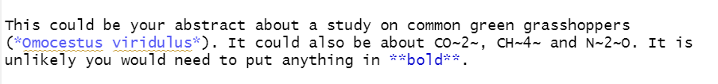

```{r setup, include=FALSE}
knitr::opts_chunk$set(echo = TRUE, eval = TRUE)
```

# What is Quarto

Launched in summer 2022, Quarto is similar to the older R Markdown. Instead of exporting graphs and pasting into a Word document, it lets you create a document - graph, text and all. This can make editing easier for you, less confusing if collaborating and better for reproducibility.

This tutorial helps you make an example Quarto document so that you have the choice to use Quarto in the future or understand how others use it.


@alison_horst

## Open a Quarto file

In RStudio (version 2022.07.01 or later) go to the **File** menu > **New File** > **Quarto Document**. In the pop up, give the Quarto file a Title such as **My Report**. Select the radio button for **Word** (note you can select other outputs) and click **Create**.


<br>

Now save it by going to **File** > **Save As**. You could name it **My_Big_Important_Report**

You will see there is already template content in the Quarto file. Click **Render** at the top so you understand how Render reads the Quarto file and converts the code into a Word document.

This is a Word file that is saved in your R project file. You can edit it by making changes in Quarto in RStudio and it will rewrite the word file. When it is finished you can upload, submit or print it as you would with any other Word file.

## Ways to edit

Flick between **source** and **visual** so you understand there are two options for editing. We will learn how to edit in source. 

<br>

# Make your own Quarto

Delete all template text in the Quarto file except the part at the top called the yaml (pronounced yammel).


The yaml has settings for the whole document. It does not show up in the final word document. Keep the `title` as `My Report` and the `format` as a `docx` word document. Change the `editor` from visual to `source` since we're learning to edit in the source mode using code.


## Formatting text

Try adding some text underneath the yaml. You could copy the text below:

> This could be your abstract about a study on common green grasshoppers  
> (Omocestus viridulus). It could also be about CO2, CH4 and N2O. It is unlikely you  
> would need to put anything in bold.
 
`This could be your abstract about a study on common green grasshoppers (Omocestus viridulus). It could also be about CO2, CH4 and N2O. It is unlikely you would need to put anything in bold.` 
  
Press **Render** to understand what that will look like in the final word document.

<br>

Make italic, subscript and bold text by adding in asterisks and tildes as below.



`This could be your abstract about a study on common green grasshoppers (*Omocestus viridulus*). It could also be about CO~2~, CH~4~ and N~2~O. It is unlikely you would need to put anything in **bold**.`

Press **Render** and notice the changes.

<br>

## Headings

Copy and paste the text below into your Quarto as if you have written an introduction. 

> Introduction
>
> Background
>
> This is some text about the background to the study.
>
> More background
>
> This part is another sub section of the introduction.
>
> Aims
>
> This is the last sub section of the introduction

You can add one hash tag in front of the word `# Introduction` to make it a heading. It should turn blue.

**Render** to see the difference.

<br>

Now add two hash tags in front of each of these words `## Background`, `## More background` and `## Aims` to make secondary headings. 

Render

You could write `# Methods` and `# Results`headings too.

<br>

## Code chunks

The biggest benefit of Quarto for report writing is including analyses and graphs. This saves you copying and pasting every time you change a graph or result. 

To do this use code chunks to write R code. 

Under the `Results` heading, click on the next line and click on the green c with a plus icon at the top to insert a code chunk.

In the code chunk that appears write R code to library load the palmerpenguins package and view the penguins data. Click the green play arrow at the top of that chunk so R runs the code.

```{r datain, echo = FALSE, eval = TRUE, warning = FALSE}
library(palmerpenguins)
View(penguins)
```


Run the code by clicking the green play arrow.

Now insert another code chunk. Type in the code below to run a statistical test (compare the effect of the penguin species on body mass in a lm).
```{r runmodel, echo = TRUE, eval = TRUE}
model1 <- lm(flipper_length_mm ~ body_mass_g, data = penguins)
summary(model1)
```

<br>

## Extracting numbers

We can extract numbers from our statistical output, for example, the R^2^ number from the lm is referenced by `summary(model1)$r.squared`

<details>
  <summary>**Finding a Reference**</summary>

To find out the reference to a number, the function `str` is useful. Try typing `str(summary(model1))` into your console and pressing return to run. You can see R^2^ is towards the bottom. 

</details>

<br>

This is useful because now we can embed numbers in the text by writing the letter r and the reference surrounded by backquotes. Useful if the analysis changes.

![alt.text= Text says Flipper length and body mass were significantly associated in the penguins (linear model, R~2~ = r summary(model1) dollar sign r.squared, F(r summary(model1) dollar sign fstatistic[2],r >summary(model1) dollar sign fstatistic[3]) = r summary(model1)$fstatistic[1], p = r summary(model1) dollar sign coefficients[2,4]).](./images/statsrefs.png)

**Render**

:::: {.cadetbluebox data-latex=""}
::: {.center data-latex=""}
:::

It is possible to pass the references through functions so that the numbers are displayed correctly. For example you might want to display to 2 decimal places or display as less than 0.05. 
::::

<br>

## Plots

Now include a plot by writing another code chunk containing the following code.
```{r plot, warning=FALSE}
library(ggplot2)
ggplot(penguins, aes(x=body_mass_g, y=flipper_length_mm)) +
  geom_point()
```

**Render** to see what happens.

<br>

## Echo

Some parts we want to be in our final Word document and others we don't. Including `#| echo: false` in the second line of our code chunk will mean the code is not "echoed" in the Word document i.e. won't be included.

**Challenge**

Add `#| echo: false` to the code chunks you don't think should be in the Word document.

<br>

Other options you might want to include are `#|eval: true`, `#| error: false` and `#| warning: false` which tell R to run the code, don't print errors and don't print warning in the Word document.

**Render** again to see how the document looks.

<br>

<br>

# More Quarto Possibilities

<br>

## Add Citations and References

First add a `# Discussion` heading.

To include citations and references you need to create a .bib file from your reference manager (such as Endnote or Mendeley) and save in your Rproj. Find out how to do this using these websites...

If you don't have a reference manager set up, download this bibtex file from here.[insert link]

Tell R what your .bib file is by adding another line to your yaml that reads `bibliography: library.bib`

All references in the .bib file have a key to identify them. Using the key we can insert a citation as below.

`This sentence would be based on an idea I took from a paper [@Wood2021].`

**Render**

Notice that the Reference has been automatically added to a section at the bottom of the document.

Add the heading `# References` to the bottom of your quarto file.

<br>

## Page Breaks

If we wanted to have the title on its own page insert a page break after the title.



<br>

## Include an image

If we wanted to include this image on our title page
{fig-alt="A photo of a green cricket."}

By James Lindsey at Ecology of Commanster, CC BY-SA 3.0, https://commons.wikimedia.org/w/index.php?curid=1682204

We need to save the photo to an image file in our R proj. You can download this image [insert link] or use an image of your own.

Then we use this code.

`{fig-alt="A photo of a green cricket."}`

<br>

## Links

In your `Methods` section write the following sentence

Distributions of grasshoppers were taken from orthoptera.org.uk

If you wanted that text to be a hyperlink add `<` and `>`

`Distributions of grasshoppers were taken from <orthoptera.org.uk>`

Alternatively, you could have different text

`Distributions of grasshoppers were taken from the [Orthoptera and allied insect webpages](orthoptera.org.uk)`

**Render**

<br>

## Add a Content Page

Adjusting the YAML as below will add a contents page. `toc` stands for table of contents. `depth` relates to the level of hashtag headings.

title: "My Report"
format: docx
editor: source
bibliography: library.bib
toc: true
toc-depth: 2
toc-title: "Contents"

**Render**

<br>

## Quarto website

For more Quarto coding there is a [Quarto guide](quarto.org/docs/guide).

<br>

**Challenge**

Take an assessment you are working on or have already done and recreate the word document using a Quarto file.

When you come across something you don't know how to format use the internet to find the solution. 

