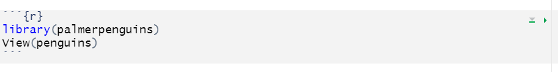

```{r setup, include=FALSE}
knitr::opts_chunk$set(echo = TRUE, eval = TRUE)
```

# What is Quarto

Launched in summer 2022, Quarto is similar to the older R Markdown. Instead of exporting graphs and pasting into a Word document, it lets you create a document - graph, text and all. This can make editing easier for you, less confusing if collaborating and better for reproducibility.

This tutorial helps you make an example Quarto document so that you have the choice to use Quarto in the future or understand how others use it.


@alison_horst

## Open a Quarto file

In RStudio (version 2022.07.01 or later) go to the **File** menu > **New File** > **Quarto Document**. In the pop up, give the Quarto file a Title such as **My Report**. Select the radio button for **Word** (note you can select other outputs) and click **Create**.


<br>

Now save it by going to **File** > **Save As**. You could name it **My_Big_Important_Report**

You will see there is already template content in the Quarto file. Click **Render** at the top so you understand how Render reads the Quarto file and converts the code into a Word document.

<br>

## Ways to edit

The Word file is saved in your R project file. You can edit it by making changes in Quarto in RStudio and it will rewrite the word file. When it is finished you can upload, submit or print it as you would with any other Word file.

Flick between **source** and **visual** at the top left so you understand there are two options for editing. We will learn how to edit in source. 

<br>

# Make your own Quarto

Delete all template text in the Quarto file except the part at the top called the yaml (pronounced yammel).


The yaml has settings for the whole document. It does not show up in the final word document. Keep the `title` as `My Report` and the `format` as a `docx` word document. Change the `editor` from visual to `source` since we're learning to edit in the source mode using code.


## Formatting text

Try adding some text underneath the yaml. You could copy the text below:

`This could be your abstract about a study on common green grasshoppers`
`(Omocestus viridulus). It could also be about CO2, CH4 and N2O. It is`
`unlikely you would need to put anything in bold.` 
  
Click **Render** to understand what that will look like in the final word document.

<br>

Make *italic*, ~subscript~ and **bold** text by adding in asterisks and tildes as below.

`This could be your abstract about a study on common green grasshoppers`
`(*Omocestus viridulus*). It could also be about CO~2~, CH~4~ and N~2~O. It is` 
`unlikely you would need to put anything in **bold**.`

Click **Render** and notice the changes.

<br>

## Headings

Copy and paste the text below into your Quarto as if you have written an introduction. 

`Introduction`

`Background`

`This is some text about the background to the study.`

`More background`

`This part is another sub section of the introduction.`

`Aims`

`This is the last sub section of the introduction`

Add one hash tag in front of the word `# Introduction` to make it a heading. It should turn blue.

**Render** to see the difference.

<br>

Now add two hash tags in front of each of these words `## Background`, `## More background` and `## Aims` to make secondary headings. 

**Render**

Write `# Methods` and `# Results`headings too.

<br>

## Code chunks

The biggest benefit of Quarto for report writing is including analyses and graphs. This saves you copying and pasting every time you change a graph or result. 

To do this use code chunks to write R code. 

Under the `Results` heading, click on the next line and click on the green c with a plus icon at the top to insert a code chunk.


In the middle of the code chunk that appears, write R code to library load the palmerpenguins package and view the penguins data. It will look like the picture below with three backticks at the top and bottom and `r` in curly brackets.

```{r datain, echo = FALSE, eval = TRUE, warning = FALSE, error=FALSE}
library(palmerpenguins)
View(penguins)
```



In the top right corner of the chunk, click the green play arrow so R runs the code.

<br>

Now insert another code chunk. Type in the code below to compare penguin flipper length with body mass in a lm.
```{r, echo = FALSE, eval = FALSE}
model1 <- lm(flipper_length_mm ~ body_mass_g, data = penguins)
summary(model1)
```


```{r runmodel, echo = TRUE, eval = TRUE}
model1 <- lm(flipper_length_mm ~ body_mass_g, data = penguins)
summary(model1)
```

<br>

## Echo

You probably don't want these code chunks to show up in the final Word document. Including `#| echo: false` in the second line of our code chunk will mean the code is not "echoed" in the Word document i.e. it will not be included.

<br>

**Challenge**

Add `#| echo: false` to the code chunks.

Other lines you might want to include are `#|eval: true` (tells R to run the code), `#| error: false` (tells R do not print errors) and `#| warning: false` (tells R to not print warnings in the Word document).

**Render**

<br>

## Extracting numbers

We can extract numbers from our statistical output, for example, the R^2^ number from the lm is referenced by `summary(model1)$r.squared`

<details>
  <summary>**Finding a Reference**</summary>

To find out the reference to a number, the function `str` is useful. Try typing `str(summary(model1))` into your console and pressing return to run. You can see R^2^ is towards the bottom. 

</details>

<br>

This is useful because now we can embed numbers such as the R^2^, F, dfs and p values in the text by writing the letter r then the reference surrounded by backquotes. Useful if the analysis changes.

![alt.text= Text says Flipper length and body mass were significantly associated in the penguins (linear model, R~2~ = r summary(model1) dollar sign r.squared, F(r summary(model1) dollar sign fstatistic[2],r >summary(model1) dollar sign fstatistic[3]) = r summary(model1)$fstatistic[1], p = r summary(model1) dollar sign coefficients[2,4]).](./images/statsrefs.png)

**Render**

:::: {.cadetbluebox data-latex=""}
::: {.center data-latex=""}
:::

It is possible to pass the references through functions so that the numbers are displayed correctly. For example you might want to display to 2 decimal places or display as less than 0.05. 
::::

<br>

## Plots

Now include a plot by writing another code chunk containing the following code.
```{r plot, warning=FALSE, eval = FALSE, echo = TRUE}
library(ggplot2)
ggplot(penguins, aes(x=body_mass_g, y=flipper_length_mm)) +
  geom_point()
```

**Render** to see what happens.

 <br> 

You can include a figure legend by adding `#| fig-cap: penguin flipper length and body mass were associated` in the line above the code and below the `{r}`.

**Challenge**

For the plot code chunk,decide if should put true or false for `#| echo:` and `#| eval:`

<br>

<br>

# More Quarto Possibilities

<br>

## Add Citations and References

First add a `# Discussion` heading.

To include citations and references you need to create a .bib file from your reference manager (such as Endnote or Mendeley) and save in your Rproj.

<details>
  <summary>**Creating a .bib File**</summary>

**If you have an Endnote online account**. Format > Export References. References: select All References in My Library. In Export style: select BibTeX Export. Save. A file will download. Open the file and go to File > Save as and rename the file references.bib. Then move that file to your Rproj files.

**If you have a Mendeley account**, tick the boxes to select your references. Choose Export at the bottom and choose BibTeX (*.bib). Save that file to your Rproj.

</details>

<br>

If you don't have a reference manager set up, download [this BibTeX file](./data/export.bib) and save to your Rproj.

Tell R what your .bib file is called by adding another line to your yaml. If your file is called `export.bib` add a line that reads `bibliography: export.bib`

In the .bib file each reference has an identifying key. It might look like `Vedenina2020` or `RN15`. Using these keys we can insert a citation as below.

`This sentence would be based on an idea I took from a paper [@Vedenina2020].`
`This piece of text might be from an idea based on two papers [@Ronacher2019;@Illich2022].`

**Render**

Notice that the Reference has been automatically added to a section at the bottom of the document.

Add the heading `# References` to the bottom of your quarto file.

<br>

## Title and Contents Page

Adjusting the YAML as below will add title page information and a contents page. `toc` stands for table of contents. `depth` relates to the level of hashtag headings.

`title: "My Report"`
`subheading: "other information that needs to be on title page"`
`author: "Your Name"`  
`format: docx`  
`editor: source`  
`bibliography: export.bib`  
`toc: true`  
`toc-depth: 2`  
`toc-title: "Contents"`  

**Render**

<br>

## Page Breaks

If we wanted to have the abstract and introduction at the top of new pages, put one `` after the yaml and another between the abstract and introduction text.

**Render**

<br>

## Images

{fig-alt="A photo of a green cricket."}

Suppose we wanted to include this image in our methods.

We need to save the photo to an images file in our Rproj. You can download [this cricket image file](./images/cricket.png) or use an image of your own.

Then we use this code.

``

`caption =` adds a figure legend

``

Accessible alternative text is added using  curly brackets.

`{fig-alt="A photo of a green cricket."}`

<br>

## Links

In your `Methods` section write the following sentence

`Distributions of grasshoppers were taken from orthoptera.org.uk`

If you wanted that text to be a hyperlink add `<` and `>`

`Distributions of grasshoppers were taken from <orthoptera.org.uk>`

Alternatively, you could have different text for the link.

`Distributions of grasshoppers were taken from the [Orthoptera and`
`allied insects webpages](orthoptera.org.uk)`

**Render**

<br>

## Quarto website

For more Quarto coding there is a [Quarto guide](quarto.org/docs/guide).

This youtube video shows you how to [change the fonts](https://youtu.be/8CQiVVgQoH0) used in the Word document by creating a template.

<br>

**Challenge**

Take an assessment or report you are working on or have already done and recreate the word document using a Quarto file.

When you come across something you don't know how to do use the internet to find the solution. 

