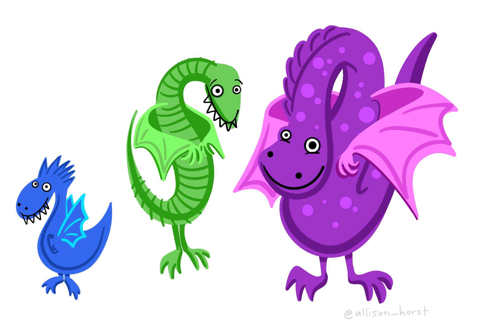

```{r setup, include = FALSE}
knitr::opts_chunk$set(echo = TRUE, eval = TRUE, comment = NA)
```

# Dragon example

## Linear models reminder

We will use a fictional study system - dragons! If you are using R for yourself, click this [link to the dragon data](https://raw.githubusercontent.com/acriach/BLGY5112M/main/data/dragons.csv) and right click to save it in your data file in your R project.



Imagine we went to eight mountain ranges (`mountainRange`) and collected data on the intelligence (`testScore`) and size (`bodyLength`) of 480 dragons. We want to know if size affects their intelligence since we want intelligent dragons that we can train but that aren't too big and scary!

Load the csv dataset
```{r}
dragons <- read.csv(file = "data/dragons.csv")
head(dragons)
```

<br>

One way to analyse this data would be to fit a linear model.

Fit the model with `testScore` as the response and `bodyLength` as the predictor and have a look at the output:
```{r}
basic.lm <- lm(testScore ~ bodyLength, data = dragons)
summary(basic.lm)
```
View the 'Code Explained' if using lm is new to you.

<details>
  <summary>**Code Explained**</summary>
* `basic.lm` is the name we gave to the model object. We could have chosen to name it anything.
* `lm()` is the function that runs the linear model
* `testScore` is the name of our variable that we want to be the response in the model.
* The tidle `~` separates the response and predictors in the lm code.
* `bodyLength` is the name of the column of data that we want as the predictor in the model
* `data =` is an argument in the lm function
* `dragons` is the name of the dataset that we want R to use.

</details>

<br>

**Challenge**

Write out how you could report the output from the summary. (You may want to look back at the Linear Models lesson.)

<details>
  <summary>**Answer**</summary>

Points you could take from the output include:  
* The coefficient estimate for `bodyLength` suggests that the model predicts `testScore` to increase by `0.55` for an increase of 1 in `bodyLength`.  
* The coefficient - standard error for `bodyLength` suggest the `testScore` can vary by 0.06.  
* The p value under `Pr(>|t|)` is significant indicating we might reject the null hypothesis that there is no relationship between `bodyLength` and `testScore`.  
* R^2^ is `0.1529` suggesting that 15.29% of the variance in `testScore` is explained by `bodyLength`.
</details>

<br>

Let’s plot the data with ggplot2:
```{r, eval = TRUE, message = FALSE, warning = FALSE}
library(tidyverse)  # load the package containing both ggplot2 and dplyr
```

```{r, warning=FALSE, message=FALSE}
(dragonPlot <- ggplot(dragons, aes(x = bodyLength, y = testScore)) +
  geom_point() +
  geom_smooth(method = "lm"))
```

Okay, both the linear model and the plot, suggest bigger dragons do better in our intelligence test. From our knowledge of dragons, that seems a bit odd: size shouldn’t really affect the test scores.

But are the assumptions met?

<br>

The plot above and below suggest we roughly meet the assumption of **linearity**. 
```{r}
plot(basic.lm, which = 1)  # This is not perfect so we'd need to keep this in mind. For your own data be careful:the bigger the sample size, the less of a trend you'd expect to see.
```

<br>

Next, check the assumption that the **residuals are normal**:
```{r}
plot(basic.lm, which = 2)  # some deviations at the ends but this is generally fine
```

<br>

Then check the assumption of **homoscedasticity** (equal variance of residuals):
```{r}
plot(basic.lm, which = 3)  # a bit off but again doesn't look too bad
```

<br>

But another assumption of a linear model is **independent observations**.

This brings us to...

<br>

## Why use a mixed model

Consider the description of the dragon study again (repeated below).

> Imagine we went to eight mountain ranges (`mountainRange`) and collected data on the intelligence (`testScore`) and size (`bodyLength`) of 480 dragons.

**Challenge**

What is it that may not be right about analysing the data using a lm. Type your thoughts in your R script.

<details>
  <summary>**Answer**</summary>

The analysis has not considered that there could be differences in the dragons among the eight different **mountain ranges**. 

The dragons can be grouped by mountain range. Therefore, the dragons (and data) are not **independent**. 

</details>

<br>

:::: {.cadetbluebox data-latex=""}
::: {.center data-latex=""}
:::

Be aware that the word independent in statistics can be used to describe 1) independent data as well as 2) independent variables also known as predictors or factors. Confusingly, these are two different concepts. 
  
::::
 
<br>

It’s possible that the dragons from within each mountain range are more similar to each other than the dragons from different mountain ranges.

Have a look at a boxplot of the data to see if this is true: 
```{r}
boxplot(testScore ~ mountainRange, data = dragons)  # Looks like something is going on here. The median test score for different mountain ranges is different.
```

We could also create a scatterplot and colour points by mountain range:

```{r}
(colour_plot <- ggplot(dragons, aes(x = bodyLength, y = testScore, colour = mountainRange)) +
  geom_point(size = 2) +
  theme_classic() +
  theme(legend.position = "none"))
```

From the above plots, it looks like our mountain ranges vary both in the dragon body length AND in their test scores. This confirms that our observations from within each of the ranges aren’t independent. We can’t ignore that: it could lead to a completely erroneous conclusion!

So what do we do?

We could run eight separate analyses and fit a regression for each of the mountain ranges.

Lets have a quick look at the data split by mountain range. We use the `facet_wrap()` to do that:
```{r}
(split_plot <- ggplot(aes(bodyLength, testScore), data = dragons) + 
  geom_point() + 
  facet_wrap(~ mountainRange) + # create a facet for each mountain range
  xlab("length") + 
  ylab("test score"))
```

Doing eight analyses increases our chance of a **Type 1 error**. It also decreases the sample size from 480 dragons to 60. Not ideal!

We want to use all the data, but control for the data coming from different mountain ranges. We are not interested in quantifying test scores for each specific mountain range. This means we could use `mountainRange` as a **random effect** in a **mixed model**.

The explanatory variable `bodyLength` will be the **fixed effect** in the mixed model.

<br>

:::: {.cadetbluebox data-latex=""}
::: {.center data-latex=""}
:::

The word **mixed** in mixed model refers to the mix of **random** and **fixed** effects. 

Do not be misled by the use of the word random for random effect. It does not mean that the variable is mathematically random in anyway.

::::
 
<br>

## Running a mixed model

Mixed models are run using the `lmer()` (linear mixed effect regression) function in the package `lme4`.

Library load the package ensuring it is installed first:
```{r, warning=FALSE, message=FALSE}
library(lme4)
```

A **random effect** is included in the model using the code `(1|mountainRange)`:
```{r}
mixed.lmer <-  lmer(testScore ~ bodyLength + (1|mountainRange), data = dragons)
summary(mixed.lmer)
```

<br>

## Interpreting mixed model output

There are no p values in the output. For mixed models, it is best to use other ways to determine if `bodyLength` has an effect on `testScore`.

### Estimate

In the `Fixed effects` section of the output, look at the `Estimate` for `bodyLength`. 

```{r, echo = FALSE, eval = TRUE}
coef(summary(mixed.lmer))
```

Notice that the `Std. Error` suggests the estimate might be 0 for `bodyLength`. That means that the effect (think of effect as the slope of the fitted line in a scatterplot) might be no different to 0. In other words, there is no effect.

<br>

### Likelihood ratio test

We could alternatively compare our model to a **reduced model** that does not contain our fixed effect `bodyLength`. We compare the two models in a **likelihood ratio test** using the function `anova()`.

:::: {.cadetbluebox data-latex=""}
::: {.center data-latex=""}
:::

Using <kbd>`anova()`</kbd> in this way to compare models can be done for other models, not just mixed models. 
  
::::

<br>

Fit a full model and a reduced model:
```{r}
full.lmer <- lmer(testScore ~ bodyLength + (1|mountainRange), data = dragons, REML = FALSE)
reduced.lmer <- lmer(testScore ~ 1 + (1|mountainRange), data = dragons, REML = FALSE)
```
Notice the reduced model has `1` instead of `bodyLength`.
<details>
  <summary>**`REML=` Explained**</summary>
In our previous model we skipped setting REML - we just left it as default (i.e. `REML=TRUE`). This means the model used the less biased **restricted maximum likelihood** method to come up with the estimates. You should report estimates from this model.

However, when you compare models you should use `REML=FALSE` so the model uses **maximum likelihood** which doesn't rely on the coefficients of the fixed effects which are different (ie there is no fixed effect in the reduced model).

</details>

<br>

Now compare the full and reduced model using `anova()`:
```{r}
anova(reduced.lmer, full.lmer) 
```
The p value under `Pr(>Chisq)` is not significant, there is no difference between the models. This means having `bodyLength` in the model explains none of the variance in the `testScore`. `bodyLength` has no effect.

<br>

### AIC values

You can also assess models using AIC values. The model with the lower AIC value will fit the data better. Models with similar values are no different.

AIC values were given in the `anova()` output above or use the `AICc()` function in the `AICcmodavg` package:
```{r, warning=FALSE, message=FALSE}
library(AICcmodavg)
AICc(reduced.lmer)
AICc(full.lmer)
```
Generally, if models are within 2 AICc units of each other they are very similar. Within 5 units they are quite similar, over 10 units difference and you can probably be happy with the model with lower AICc. As with p-values though, there is no "hard line" that's always correct.

<br>


So we can conclude that body size has no effect on dragon intelligence and therefore we will be able to train the small ones and not use the big scary ones!

If we had not accounted for mountain range in a mixed model we may have came to the wrong conclusion.

<br>

# Identifying when a mixed model is needed

There are lots of available guides to help you run mixed models in R. 

* This lesson is adapted from Hajduk's [Introduction to Linear Mixed Models](https://ourcodingclub.github.io/tutorials/mixed-models/#six) which gives more details than here.
* There is also [Environmental Computing](https://environmentalcomputing.net/statistics/mixed-models/) mixed model lessons.

<br>

However, knowing when there is a random effect and therefore when a mixed model might be needed is more difficult.

Take your time to imagine each of the studies below, identifying the variables that is the **random effect** in each one and writing the **code** to run a mixed model.

If you get stuck, scroll down to read the Random Effect Check List box.

<br>

## Barley yield example


The effect of `variety` and type of nitrogen fertiliser `fertType` on the `yield` of barley plants, was tested in a field trial. The plants were grown in 20 different areas of the field called `area`, that were likely to vary in soil and water qualities that affected yield.
The data was called `barley`

<details>
  <summary>**Answer**</summary>
The random effect is `area` because we think it has an affect on yield and therefore want to control for it but we are not interested in how the area the plant is grown in affects the yield.
```{r, eval=FALSE}
model <- lmer(yield ~ variety + fertType +(1|area), data = barley)
```

</details>

<br>

## Caterpillar example


We want to know if development time can predict the weight of caterpillars. There may be genetic influences on weight too. We can only get 10 caterpillars from each female butterfly so use 14 females. For each of the 140 caterpillars, we note down which 1 to 14 `female` butterfly laid it, the development time `devTime` in hours and weight `wgt` in mg and call the dataset `butterflies`.

<details>
  <summary>**Answer**</summary>
The random effect is `female` because we don't care about the differences between butterfly families but it probably has an affect on weight so we should account for it.
```{r, eval=FALSE}
model <- lmer(wgt ~ devTime +(1|female), data = butterflies)
```

</details>

<br>

## Petri dish example


The effect of two bacterial inhibitors `inhib` on bacterial `growth` is tested by growing 10 spots of bacteria per 20 petri dishes `dish`. Bacterial growth seemed to vary among the petri dishes. Data was called `bacteria`.

<details>
  <summary>**Answer**</summary>
The random effect is `dish` as there are several bacterial growth per dish so they can be grouped according to what dish they are are in which might have an affect on growth.
```{r, eval=FALSE}
model <- lmer(growth ~ inhib +(1|dish), data = bacteria)
```

</details>

<br>

:::: {.cadetbluebox data-latex=""}
::: {.center data-latex=""}
:::

Random variable check list  
* Random effects are grouping factors. They are always categorical.  
* Usually you are not interested in a random effect's impact on the response variable.  
* Usually you don't care about the differences between the levels/groups of the random variable.  
* You suspect the random variable has an effect and therefore want to control for it.
  
::::

<br>

:::: {.cadetbluebox data-latex=""}
::: {.center data-latex=""}
:::

A variable might be a random effect and fixed effect. Be clear on what hypothesis you are testing. 

::::

<br>

:::: {.cadetbluebox data-latex=""}
::: {.center data-latex=""}
:::

When a random variable has less than 5 groups it is advisable to not have it as a random variable in a mixed model. Instead, include it in a model as another predictor. You may want to look at the interaction. 

::::

<br>

# More complex mixed models

Some studies might need a **random slope mixed model** or a **generalised mixed model**. Others might have random effects that are **crossed** or **nested**. 

Being aware of these concepts will mean you can look out for them in your own studies.

<br>

### Random slope mixed model

The mixed model we ran for the dragon data... 
```{r}
mixed.lmer <-  lmer(testScore ~ bodyLength + (1|mountainRange), data = dragons)
```
...was a **random intercept** model.

Here's the graph to accompany that.
```{r, echo = FALSE, eval = TRUE}
intercept_plot <- ggplot(dragons, aes(x = bodyLength, y = testScore, colour = mountainRange)) +
      geom_point(alpha = 0.5) +
      theme_classic() +
      geom_line(data = cbind(dragons, pred = predict(mixed.lmer)), aes(y = pred), size = 1) +  # adding predicted line from mixed model 
      theme(legend.position = "none",
            )  
intercept_plot
```

Notice that the different coloured lines for each mountain range would have different **intercepts**  but the same **slope** as each other. (The intercept is the point where a line crosses the y axis if it were that long.)

<br>

We could have run this mixed model instead...
```{r, eval = TRUE, warning=FALSE}
mixed.ranslope <- lmer(testScore ~ bodyLength + (1 + bodyLength|mountainRange), data = dragons) 
```
which is a **random slope** model.

Here's the corresponding graph
```{r, echo = FALSE}
(slope_plot <- ggplot(dragons, aes(x = bodyLength, y = testScore, colour = mountainRange)) +
      geom_point(alpha = 0.5) +
      theme_classic() +
      geom_line(data = cbind(dragons, pred = predict(mixed.ranslope)), aes(y = pred), size = 1) +  # adding predicted line from mixed model 
      theme(legend.position = "none",
            )  
)
```

Notice the lines for each mountain range have different intercepts **AND** slopes.

Therefore, if your exploration of the data or understanding of the study system suggests that the relationship in each group of the random effect (i.e. in each mountainRange) is different, then use a random slope mixed model.

**Challenge**
Take some time to do an internet search for another definition of the difference between random intercept and random slope mixed models.

<br>

## Generalised mixed models

Sometimes the response (dependent) variable is not continuous but a categorical variable. Just as you can use alternative **generalized** models instead of lm such as logistic or poisson, you can use other **generalised mixed** models.

For example, imagine each of our dragons was scored as passing or failing the intelligence test making the response `passFail` binary. Then you would use a **binary logistic mixed model**. 

<br>

**Challenge**

Do an internet search to find the function and the code for a binominal mixed model. Adapt the code to run an analysis on this [binomial dragon data](./data/dragons_binomial.csv) where the response variable `passFail` is if the dragon passed (1) or failed (0) the IQ test. The fixed effect is `bodyLength` and random effect is `mountainRange`. 

Once you have run the analysis, interpret the results (you might want to look back at the binomial response section of the linear model lesson) and write out the results in your script along with a suitable graph.


```{r, echo=FALSE, eval=FALSE}
dragons2 <- read.csv(file = "data/dragons_binomial.csv")
library(lme4)
```

```{r, echo = FALSE, eval = FALSE}
model <- glmer(passFail ~ bodyLength + (1|mountainRange), data = dragons2, family = binomial)
# To check for linearity they may try to bootstrap the analysis to get a better graph like in the binomial generalised linear model.
summary(model) # for glm esp binomial p values are unreliable but if look at the estimate for bodylength is pretty much 0.
anova(model) # gives F value but not p. Possibly because can't really get p values for mixed models.
full.model <- glmer(passFail ~ bodyLength + (1|mountainRange), data = dragons2, family = binomial)
reduced.model <- glmer(passFail ~ 1 + (1|mountainRange), data = dragons2, family = binomial)
anova(full.model, reduced.model) # only 2 units difference between AIC and p values is 0.9469 so not effect
```

<br>
<br>

## Nested design

**Challenge**

Do an internet search to find an example of a study or experimental set up, that includes a nested design. You have 3 tasks:  
* Type a simple description of the experiment  
* Name the variables that are the **response**, the **fixed effect**, the **random effects** and what is nested in what.  
* Write out an example of R code for a mixed model with this nested design. 

Tip - searching for an R tutorial or guide on a nested mixed model will provide both an example and the code.


<br>

## Crossed random effects

**Challenge**

Do an internet search to find an example of a crossed (partial or fully) design. You have 3 tasks:  
* Type a simple description of the experiment  
* Name the variables that are the **response**, the **fixed effect**, the **random effects** and explain why it is crossed.  
* Then write out an example of R code that would run a mixed model with crossed random effects.

<br>

<br>

[Source](https://github.com/acriach/BLGY5112M)  
[CC Licensed](https://creativecommons.org/)

Adapted from the [Coding Club](https://ourcodingclub.github.io/) tutorial [Introduction to Linear Mixed Models](https://ourcodingclub.github.io/tutorials/mixed-models/#six) by Gabriela K Hajduk.
