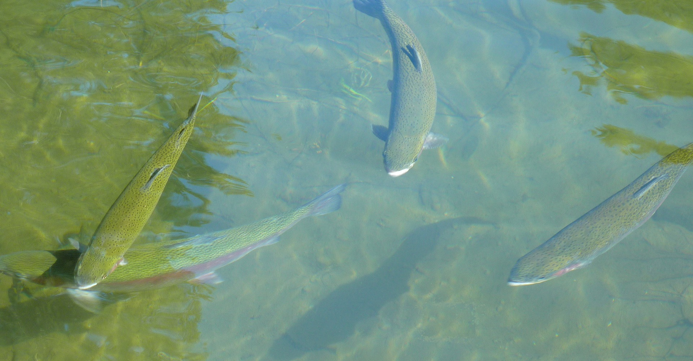

## PCA

:::: {.cadetbluebox data-latex=""}
::: {.center data-latex=""}
:::

If you have a good reason to expect a difference in a particular **direction**, which is whether the treatment group is higher or lower than the control, you set `alternative = "greater"` or `alternative = "less"` - it doesn’t matter which you choose for this pwr.t.test command. If you cannot be sure if the treatment will be higher or lower weight, you set `alternative = "two.sided"`. 
::::

## Running the analysis
 


  

## Interpreting the results
 
**Challenge**

Calculate the power for the t test in one of these studies.

<details>
  <summary>**Possible Answer to Study 2**</summary>

Suppose you planned to test 50 birds (n = 25 per group). And used the effect size d = 0.29 as reported in [Osbrink et al, 2021](https://doi.org/10.1098/rspb.2020.2851).
```{r}
pwr.t.test(n = 25, d = 0.29, sig.level = 0.05, power = NULL)
```
Power would be 0.17 so it would only be worthwhile doing the study if it was feasible to increase the number of birds.

</details>


  
Source
Licensed under a Creative Commons Attribution-ShareAlike 4.0 International License

Adapted from EnvironmentalComputing https://github.com/nicercode/EnvironmentalComputing